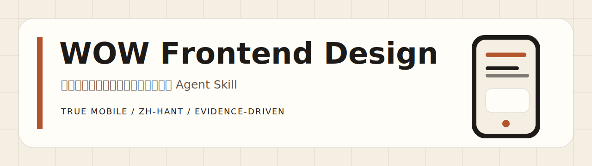
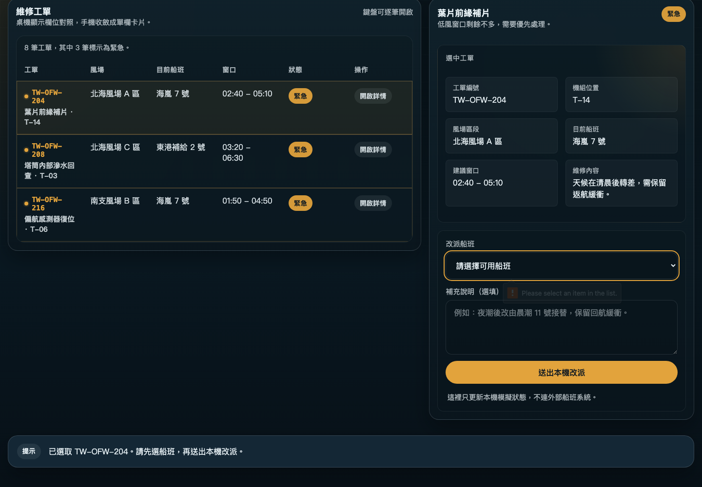
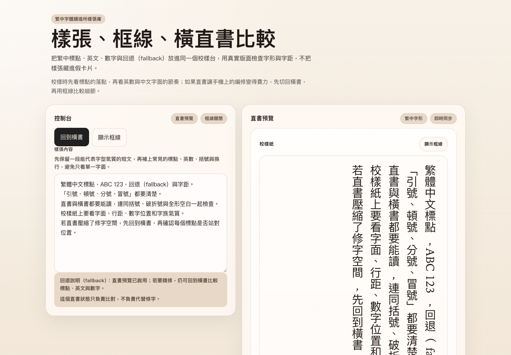
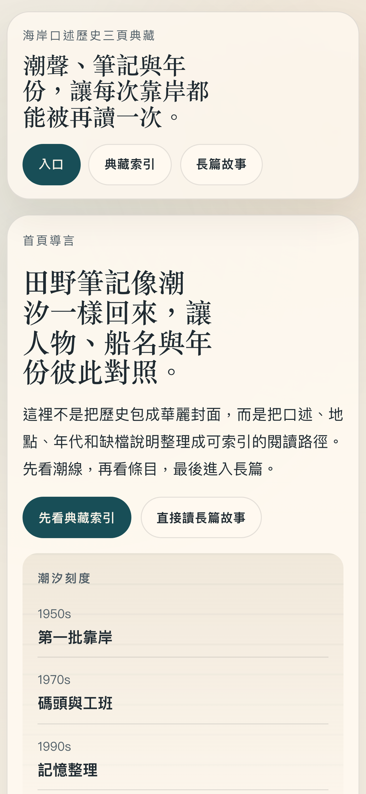
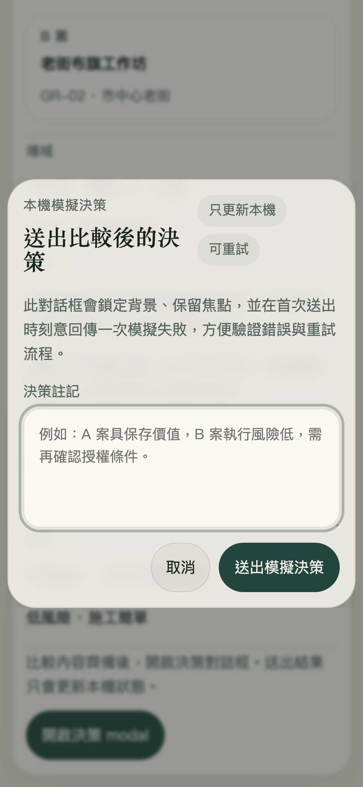

<p align="center">
  
</p>

<p align="center">
  <a href="https://github.com/NoMoneyDaddy/Wow-Frontend-Design/actions/workflows/ci.yml"></a>
  <a href="LICENSE"></a>
  <a href="https://github.com/NoMoneyDaddy/Wow-Frontend-Design/stargazers"></a>
  <a href="https://github.com/NoMoneyDaddy/Wow-Frontend-Design/commits/main"></a>
</p>

<h1 align="center">WOW Frontend Design</h1>

一套可攜式、production-oriented 的 Agent Skill，用來從零打造或安全重構高辨識度前端。它依偵測到的框架、host、工具、裝置與語系調整流程；繁體中文與不只縮放寬度的手機版面／互動是核心能力。可攜不等於所有模型／平台都已實測，也不保證一次生成即可上線。版本變更見 [`CHANGELOG.md`](CHANGELOG.md)。

Portable Agent Skill for designing, building, auditing, and refactoring distinctive, production-oriented frontends—with first-class Traditional Chinese and mobile UX. Portability is not universal empirical certification.

## 它解決什麼

- 從空專案建立概念、設計系統、版面、互動與 production code。
- 偵測既有專案的框架、入口、樣式、i18n、測試與風險，再做最小安全修改。
- 建立「概念句、版面語法、色彩規則、範圍相稱的 authored distinction」；新建／大改才加入招牌時刻，局部修復不擴張範圍。
- 手機版會重排、替換、延後或改變互動，不只把桌面欄位改成直向。
- 內建繁中、CJK、長翻譯、RTL、字型 fallback 與 locale QA。
- 納入 WCAG 2.2 AA、Core Web Vitals、reduced motion、鍵盤、zoom、錯誤狀態與效能驗證。
- 模型不自報強弱：外部、分任務能力 profile 決定起始 lane；實際 schema／工具／驗證結果只能自動降級，不能自行升級。
- 維持一份精簡核心與按需載入的直接 references；不分叉 `lite`／`full` 兩套真相，短 context host 只作明示降級 adapter。
- 內建 motion 技術階梯、SVG 信任／嵌入／授權管線與靜態風險稽核器。
- 驗證失敗會自動回送 AI 修正並局部重驗，不把中間錯誤丟給使用者；始終保留最佳可預覽版本與截圖。
- 缺少驗證工具時，優先沿用 lockfile；無 pin 才解析最新穩定相容版並鎖定到專案或 evaluator cache，再自動續跑。不做 global install，也不偷改產品 runtime dependencies。

## 成果展示

目前發布的 v6 development/regression cohort 只使用 `gpt-5.4-mini`：8 個不同產品、12 個頁面、4 種裝置 profile，共 64 張 PNG。8 案都依最新 Skill 完成自修正，8/8 `DESIGN.md` 通過 pinned 官方 verifier。人工並排檢閱曾找出補助對話框與字體樣張頁的中文標題孤字；加入逐行 gate、修正標題主軌與 mobile 字級後，最終完整重驗的 deterministic visual、runtime、network、文字流、標題流、layout 與 locale findings 都是 0。同一批案例曾參與規則與 evaluator 修正，因此不是 held-out validation；它只證明這批固定案例，不代表 Skill 已泛化、實體手機、所有瀏覽器、正式 WCAG conformance 或所有模型。

| 桌機互動：風場派工 | 桌機互動：字體樣張 |
| --- | --- |
|  |  |

| 手機重排：口述歷史 | 手機互動：補助審查 |
| --- | --- |
|  |  |

[檢閱全部 64 張截圖](assets/product-flow-v6/) · [完整測試結果與限制](evals/RESULTS.md) · [可重現測試方案](evals/TEST_PLAN.md)

舊 v4／v5 截圖已清空；其原始 targets 只保留作歷史問題來源，不代表目前品質。

## 相容與安裝

本專案遵循開放的 [Agent Skills specification](https://agentskills.io/specification)，可供 Codex、Claude Code、GitHub Copilot、Gemini CLI 與自訂 wrapper 載入；相容不等於每個 host、模型與工具組合都已完成實測。[平台支援說明](PLATFORM_SUPPORT.md)與[一次性機器快照](evals/platform-support.json)逐格分開官方文件、安裝、發現、呼叫、實作、browser 與 visual 證據；沒有排定下次查核日期，只描述這一版。安裝路徑、5 分鐘成功流程、remote sandbox、版本 pin、更新與卸載由 [`INSTALL.md`](INSTALL.md) 單一維護。

## 使用

新專案：

```text
Use $wow-frontend-design to create a premium Traditional Chinese travel journal.
Desktop should feel editorial; mobile should use a distinct thumb-first journey.
```

既有專案：

```text
Use $wow-frontend-design to inspect this repository and redesign the checkout.
Preserve routes, APIs, analytics, and the current framework. Verify mobile, errors, and zh-Hant.
```

不確定如何描述時，只要說明產品、使用者與主要任務；skill 會推導可逆的設計方向，只在答案會實質改變範圍或架構時提問。

實際流程是：檢查專案與可用能力 → 分類建置／重構／修復範圍 → 建立設計 thesis 與 `DESIGN.md` → 實作真實狀態與 mobile transformation → 驗證 → 自動修正 → 交付最佳可預覽版本。Deterministic finding 會先回送 AI 修正，不要求使用者傳話；同一根因連續三次仍失敗才停止盲修，並保留產物、證據與下一個可執行動作，標為 `PARTIALLY VERIFIED`，而不是丟掉結果。

多路由、新產品流程或資訊層級尚未收斂時，可先產生互相綁定的 `site-manifest.json` 與 `wireframe-plan.json`。它們分別描述 IA／權限／發現意圖，以及區域／內容極端值／狀態／互動／手機轉換；crawler 用的 XML Sitemap 是第三種獨立 artifact。低風險元件修補不強制 wireframe，實作需求也不能停在 wireframe。

建立或變更視覺系統時，Skill 會在頁面組合前建立／更新 repository-root `DESIGN.md`。官方格式接受 quoted `oklch()`；production CSS 仍保留 sRGB fallback 與 rendered contrast 檢查。驗證器依 lockfile 使用精確固定的穩定版 `@google/design.md`，缺工具時安全補齊並續跑；無法安裝也不會丟掉網站產物。

## 文件

- [安裝與 host 路徑](INSTALL.md)
- [平台／OS／環境／模型支援說明](PLATFORM_SUPPORT.md)
- [版本變更](CHANGELOG.md)
- [資安回報政策](SECURITY.md)
- [Skill 核心流程](wow-frontend-design/SKILL.md)
- [評測方法與重現方式](evals/README.md)
- [完整測試方案與執行紀錄](evals/TEST_PLAN.md)
- [最新測試結果與限制](evals/RESULTS.md)
- [平台／OS／環境／模型支援快照](evals/platform-support.json)
- [公開能力狀態](evals/capability-status.json)

## 授權

[MIT](LICENSE) © 2026 奶爸 and contributors。研究來源、`NOASSERTION` 邊界與 evaluator 開發依賴見 [`THIRD_PARTY_NOTICES.md`](THIRD_PARTY_NOTICES.md)；上游 Skill 僅作批判性研究，不代表其文字、程式或資產已被併入本專案。
