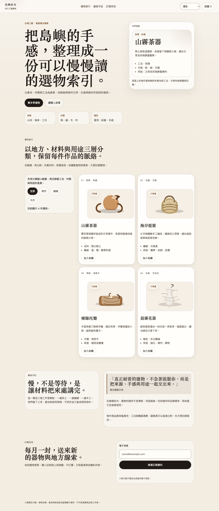
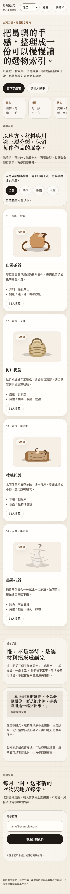

<p align="center">
  
</p>

<p align="center">
  <a href="https://github.com/NoMoneyDaddy/Wow-Frontend-Design/actions/workflows/ci.yml"></a>
  <a href="LICENSE"></a>
  <a href="https://github.com/NoMoneyDaddy/Wow-Frontend-Design/stargazers"></a>
  <a href="https://github.com/NoMoneyDaddy/Wow-Frontend-Design/commits/main"></a>
</p>

<h1 align="center">WOW Frontend Design</h1>

一套可攜式、production-oriented 的 Agent Skill，用來從零打造或安全重構高辨識度前端。它依偵測到的框架、host、工具、裝置與語系調整流程；繁體中文與真正的手機體驗是核心能力。可攜不等於所有模型／平台都已實測，也不保證一次生成即可上線。

Portable Agent Skill for designing, building, auditing, and refactoring distinctive, production-oriented frontends—with first-class Traditional Chinese and mobile UX. Portability is not universal empirical certification.

## 它解決什麼

- 從空專案建立概念、設計系統、版面、互動與 production code。
- 偵測既有專案的框架、入口、樣式、i18n、測試與風險，再做最小安全修改。
- 建立「概念句、版面語法、色彩規則、範圍相稱的 authored distinction」；新建／大改才加入招牌時刻，局部修復不擴張範圍。
- 手機版會重排、替換、延後或改變互動，不只把桌面欄位改成直向。
- 內建繁中、CJK、長翻譯、RTL、字型 fallback 與 locale QA。
- 納入 WCAG 2.2 AA、Core Web Vitals、reduced motion、鍵盤、zoom、錯誤狀態與效能驗證。
- 弱模型可依固定決策表與四個 checkpoint 執行，不必靠模糊的「設計感」。
- 內建 motion 技術階梯、SVG 信任／嵌入／授權管線與靜態風險稽核器。

## 實際網站產物

`evals/weak-model-showcase/` 是可直接開啟的繁中網站，不是 mockup。固定弱模型案例保留分類、收藏、表單與錯誤恢復；手機版改變導航、內容優先序、密度與視覺裁切。以下畫面來自同一份實作的真實瀏覽器輸出：

<p align="center">
  
  
</p>

產物與 evaluator-owned 驗證在 [`evals/`](evals/)；截圖只能證明已觀察的畫面，功能、鍵盤、網路、動效與可及性仍分開記錄證據。發行前截圖不建立自我引用的 commit hash；manifest 改綁精確 source、capture script、dependency lock 與 image SHA-256，CI 會拒絕任一 stale byte。

公開能力與缺口以 [`capability-status.json`](evals/capability-status.json) 為準。機器只驗 schema、固定能力清單與 artifact 路徑；狀態語意仍須人工交叉審查。它明列已測、瀏覽器觀察但失敗、靜態稽核、definition-only、research-to-rule 與未測項目；README 或模型自述不得把狀態自行升級。

## 原生 Host／Client 發現

本專案遵循開放的 [Agent Skills specification](https://agentskills.io/specification)。依各 host/client 的官方文件，下列位置可供其發現 `SKILL.md` 技能；文件相容不等於本專案已完成每個 host 的整合測試：

| 平台 | 專案安裝位置 | 個人安裝位置 | 常見呼叫方式 |
| --- | --- | --- | --- |
| OpenAI Codex | `.agents/skills/wow-frontend-design/` | `~/.agents/skills/wow-frontend-design/` | `$wow-frontend-design` 或自然語言 |
| Claude Code | `.claude/skills/wow-frontend-design/` | `~/.claude/skills/wow-frontend-design/` | `/wow-frontend-design` 或自然語言 |
| GitHub Copilot | `.github/skills/`、`.claude/skills/` 或 `.agents/skills/` | `~/.copilot/skills/` 或 `~/.agents/skills/` | 自然語言；Copilot CLI 可用 slash command |
| Gemini CLI | `.gemini/skills/` 或 `.agents/skills/` | `~/.gemini/skills/` 或 `~/.agents/skills/` | 自然語言或 skills 指令 |

官方依據：[Codex skills](https://learn.chatgpt.com/docs/build-skills)、[Claude Code skills](https://code.claude.com/docs/en/slash-commands)、[GitHub Copilot agent skills](https://docs.github.com/en/copilot/how-tos/copilot-on-github/customize-copilot/customize-cloud-agent/add-skills)、[Gemini CLI agent skills](https://geminicli.com/docs/cli/using-agent-skills/)。本 repo 已實跑 Codex 與 Claude CLI；Copilot、Gemini CLI、Claude API 與 claude.ai 仍維持未整合實測狀態。

不原生支援 Agent Skills 的模型仍可使用：把 [`SKILL.md`](wow-frontend-design/SKILL.md) 當成專案／系統指令，並依其中路由按需附上 `references/`；掃描器可獨立執行。

## 安裝

最快方式、官方 host 路徑、發現驗證、版本 pin、停用與卸載見 [`INSTALL.md`](INSTALL.md)。

Codex 可直接交給 AI 安裝：

```text
Use GitHub CLI to preview and install wow-frontend-design from
NoMoneyDaddy/Wow-Frontend-Design at commit <FULL_COMMIT_SHA> for Codex user scope.
Do not overwrite an existing skill or execute bundled scripts during installation.
```

官方 GitHub CLI preview（需 `gh >= 2.90.0`；preview 介面可能變動）：

```bash
gh skill preview NoMoneyDaddy/Wow-Frontend-Design wow-frontend-design/SKILL.md
gh skill install NoMoneyDaddy/Wow-Frontend-Design wow-frontend-design/SKILL.md --agent codex --scope user
```

正式環境再加 `--pin <release-tag-or-full-sha>`。無 GitHub CLI 或採完全本機流程時，使用下方 clone/copy；不提供會執行第三方 package lifecycle 的 `npx` fallback。

先取得專案：

```bash
git clone https://github.com/NoMoneyDaddy/Wow-Frontend-Design.git
```

以所有支援 `.agents/skills` 的平台為例，安裝到個人範圍：

```bash
mkdir -p ~/.agents/skills
cp -R Wow-Frontend-Design/wow-frontend-design ~/.agents/skills/
```

Claude Code 個人範圍：

```bash
mkdir -p ~/.claude/skills
cp -R Wow-Frontend-Design/wow-frontend-design ~/.claude/skills/
```

若只想套用到單一 repo，把同一個 `wow-frontend-design/` 複製到上表的專案位置。安裝目錄內含 MIT [`LICENSE`](wow-frontend-design/LICENSE)；複製、散布或修改 skill 時必須連同版權與授權聲明一起保留。安裝第三方 skill 前，先閱讀 `SKILL.md` 與 `scripts/`；此專案的掃描器為唯讀，且會略過環境變數、credentials、symlink、依賴與 generated output。

## 使用

新專案：

```text
Use $wow-frontend-design to create a premium Traditional Chinese travel journal.
Desktop should feel editorial; mobile should use a distinct thumb-first journey.
```

既有專案：

```text
Use $wow-frontend-design to inspect this repository and redesign the checkout.
Preserve routes, APIs, analytics, and the current framework. Verify mobile, errors, and zh-Hant.
```

不確定如何描述時，只要說明產品、使用者與主要任務；skill 會推導可逆的設計方向，只在答案會實質改變範圍或架構時提問。

## 結構

```text
wow-frontend-design/
├── SKILL.md                       # 核心流程與路由
├── LICENSE                        # 安裝後必須保留的 MIT notice
├── adapters/prompt-only-compact.md # 短 context host 的明示降級 fallback
├── agents/openai.yaml             # Codex / ChatGPT UI metadata
├── references/
│   ├── creative-direction.md      # 概念、視覺語法、反模板
│   ├── anti-ai-slop.md            # 可執行反同質化、真實性與自評防線
│   ├── mobile-responsive.md       # 獨立手機構圖與驗證
│   ├── localization.md            # 繁中、CJK、RTL、多語系
│   ├── typography-webfonts.md      # 開源字體、CJK 覆蓋、載入／子集／授權
│   ├── color-system-psychology.md  # 對比、語意色、深淺模式與色彩心理證據
│   ├── visual-material-system.md   # 框線、字體、光源、材質、效果與動效語法
│   ├── design-token-portability.md # DTCG、alias／mode 與跨工具／平台 token 管線
│   ├── data-visualization-color.md # 圖表／地圖色階、非色彩冗餘與真實呈現
│   ├── brand-system-fidelity.md    # 品牌證據、系統不變量與 campaign 邊界
│   ├── behavioral-design-evidence.md # 心理／行為／廣告證據的適用邊界
│   ├── visual-storytelling.md      # 攝影／廣告／電影語言與 image-first 流程
│   ├── retrofit.md                # 既有專案安全重構
│   ├── implementation.md          # production 實作與效能
│   ├── component-composition.md    # 元件、選單、表格、材質與產品介面組合
│   ├── pattern-catalog.md          # Blocks／UI Components 全分類條件式路由
│   ├── platform-adapters.md       # framework/version/SSR/native 條件式適配
│   ├── search-discovery.md         # SEO／AEO／GEO、結構化資料與 AI crawler 政策
│   ├── motion-system.md           # 動效選型、生命週期與 reduced motion
│   ├── svg-system.md              # SVG 生成、安全、a11y、優化與授權
│   ├── advanced-media.md          # Canvas/WebGL/3D/video/sound 與降級
│   ├── frontend-security.md       # XSS/URL/CSP/auth/embed/third-party 邊界
│   ├── github-skill-research.md   # 熱門設計 skill 優缺點研究快照
│   ├── ui-skills-ecosystem.md      # UI Skills registry 快照與批判性來源抽查
│   ├── quality-gates.md           # 三輪 QA、矩陣與內部品質分數
│   ├── no-visual-first-pass.md    # 無瀏覽器／截圖環境的低風險首版協議
│   ├── wcag-aa-checklist.md       # 完整 WCAG 2.2 A/AA applicability gate
│   ├── model-routing.md            # 強弱模型、工具能力與獨立驗證分流
│   ├── design-exploration.md       # 變體、臨時 design lab 與結構化回饋
│   ├── interaction-audit.md         # A→B→A 往返、互動覆蓋與瀏覽器證據
│   ├── visual-regression-evidence.md # 截圖 provenance、像素差與人工盲審邊界
│   ├── research-validation-loop.md # 研究／模型／瀏覽器發現回灌與防過擬合
│   ├── product-discovery-usability.md # 訪談、persona、IA 與 usability 證據邊界
│   ├── curated-skill-integration.md # 外部設計／框架／媒體 Skill 條件式路由
│   ├── external-sources.lock.json   # 上游 revision／授權／路徑鎖
│   └── weak-model-playbook.md     # 弱模型固定決策流程
└── scripts/
    ├── project_scan.py            # 無依賴、唯讀專案偵測器
    ├── evidence_ledger.py         # 命令／產物證據帳本，避免靠記憶宣稱
    ├── score_weak_model_output.py # 以 ledger 校準弱模型的結論標籤
    ├── motion_svg_audit.py        # motion／SVG 靜態風險掃描
    ├── lottie_asset_audit.py      # Lottie JSON／dotLottie 壓縮檔安全預檢
    ├── contrast_pair_audit.py     # evaluator 明示不透明 sRGB 色對計算
    ├── search_discovery_audit.py  # HTML 搜尋／答案／生成式探索靜態預檢
    ├── evidence_policy.example.json # claim type 與 evaluator evidence 綁定範例
    ├── model_profile.example.json # evaluator-owned 模型能力檔範例
    ├── route_model.py              # 不信任模型自評的 deterministic router
    ├── validate_trigger_cases.py   # Skill 啟用／reference 路由 fixture 驗證
    ├── validate_external_sources.py # 外部來源 revision／授權鎖結構驗證
    ├── validate_installability.py  # 發行檔案、metadata、連結與秘密路徑檢查
    ├── validate_product_cases.py   # 非 landing 產品 fixture 結構／coverage
    ├── validate_capability_status.py # 固定能力清單與 artifact 路徑檢查
    ├── validate_screenshot_manifest.py # 截圖 hash、來源綁定與完整 PNG 解碼
    ├── validate_dashboard_evidence.py # 嚴格／診斷 replay 邊界與 artifact hash
    ├── weak_model_output.schema.json
    └── test_*.py                  # 掃描器、ledger、scorer 單元測試
```

掃描現有專案：

```bash
python3 wow-frontend-design/scripts/project_scan.py /path/to/project
python3 wow-frontend-design/scripts/project_scan.py /path/to/project --json
python3 wow-frontend-design/scripts/motion_svg_audit.py /path/to/project --fail-on high
python3 wow-frontend-design/scripts/lottie_asset_audit.py /path/to/project --fail-on high
python3 wow-frontend-design/scripts/search_discovery_audit.py /path/to/project
# 僅對確定要被索引且 canonical 真實的頁面使用：
python3 wow-frontend-design/scripts/search_discovery_audit.py /path/to/project --indexable
python3 wow-frontend-design/scripts/route_model.py /evaluator/model-profile.json \
  --task BUILD --locale zh-Hant --risk medium \
  --capability write --capability command --capability browser
```

模型不會可靠地「自己知道強弱」。正式路由由平台提供精確 model/version/tools，再對照 evaluator-owned、重複執行產生的能力檔；資料缺失、過期、驗證不獨立或出現幻覺式 pass claim 時，一律降到 `CONSTRAINED`。Skill 負責工作規則，不會自行切換模型；實際選模由 CLI、API gateway、CI 或 agent orchestrator 執行。

若聊天平台連完整核心 `SKILL.md` 都放不下，使用 [`prompt-only-compact.md`](wow-frontend-design/adapters/prompt-only-compact.md)。它是可追蹤的短 context 降級 cohort，不等同完整 Skill，也不能拿來宣稱該平台已原生支援。

只有單一線程、單一模型也能完成實作：凍結規則後，用 build/test/browser/schema/evidence ledger 當外部裁判；模型自我審查只算診斷，主觀畫面由使用者驗收。商用 API 與本地 inference runtime 都可透過 adapter 使用，但「協定可攜」不等於「每個模型已實測且品質相同」。本地模型可評測，但每次都要先揭露 model/quantization、來源授權、下載與硬體需求、命令、資料邊界及清理方式，取得使用者當次明確同意；未同意不下載、不啟動、不執行。本專案不把未跑過的模型標成已驗證。

## 證據信任邊界

Ledger、policy 與 artifacts 必須由 evaluator 控制，放在 implementation model 可寫範圍之外；只有同一 evaluator root 下的 `workspace/` 是實作工作區：

```text
evaluator-run/
├── ledger.json
├── policy.json
├── artifacts/
└── workspace/      # implementation model 唯一可寫範圍
```

Canonical CLI 形狀如下。Evaluator 必須先依 `evidence_policy.example.json` 凍結相同 case/run ID、精確 command hash、`cwd: "workspace"` 與 `artifacts/...` 路徑；不得在 implementation repo 或 `workspace/` 內建立 ledger。

```bash
EVALUATOR_ROOT=/path/to/evaluator-run
WORKSPACE="$EVALUATOR_ROOT/workspace"
LEDGER="$EVALUATOR_ROOT/ledger.json"
POLICY="$EVALUATOR_ROOT/policy.json"
ARTIFACTS="$EVALUATOR_ROOT/artifacts"
mkdir -p "$WORKSPACE" "$ARTIFACTS"

python3 wow-frontend-design/scripts/evidence_ledger.py init --ledger "$LEDGER" --case-id case-001 --run-id run-001
python3 wow-frontend-design/scripts/evidence_ledger.py run --ledger "$LEDGER" --label js-syntax --cwd "$WORKSPACE" -- node --check app.js
python3 wow-frontend-design/scripts/evidence_ledger.py artifact --ledger "$LEDGER" --label mobile-default --kind screenshot --path "$ARTIFACTS/mobile-default.png" --route / --viewport 390x844 --locale zh-Hant --state default
python3 wow-frontend-design/scripts/score_weak_model_output.py --result "$WORKSPACE/result.json" --case build --case-id case-001 --run-id run-001 --ledger "$LEDGER" --policy "$POLICY" --workspace-root "$WORKSPACE"
```

## 品質基線

- 創意與評審面向參考 [Awwwards](https://www.awwwards.com/) 的 Design、Usability、Creativity、Content，以及 responsive、accessibility、semantics、animation、performance。
- 無障礙以 [W3C WCAG 2.2](https://www.w3.org/TR/WCAG22/) AA 為預設目標。
- 中文排版參考持續更新的 [W3C Requirements for Chinese Text Layout](https://www.w3.org/International/clreq/) Draft Note 校準；它是排版指南，不是合規認證。
- 效能採 [Core Web Vitals](https://web.dev/articles/vitals) 現行 good thresholds：LCP ≤ 2.5s、INP ≤ 200ms、CLS ≤ 0.1。
- 參考專案 [creative-web-showcase](https://github.com/Langalu/creative-web-showcase) 的價值在於概念一致性、招牌互動、progressive enhancement 與三輪實機驗證；本 skill 不複製其視覺或程式碼。
- 熱門前端 Agent Skills 的星數、授權、優點與缺點快照見 [`github-skill-research.md`](wow-frontend-design/references/github-skill-research.md)。星數只用來找候選，不作品質證明。
- [`UI Skills`](https://www.ui-skills.com/skills) 在研究快照時自述收錄 140 個條目；本專案只把它當 discovery index，按視覺、響應式、排版、動效、SVG、無障礙、效能、韌性與驗證抽查代表來源，回查原始 repo、授權與標準後才採用。
- Motion 以 W3C Web Animations、View Transitions、Scroll-driven Animations 與各 runtime 官方文件為準；SVG 以 W3C SVG／WAI、SVGO、DOMPurify 與各 icon library 的原始授權為準。

## 驗證

```bash
python3 -m unittest discover -s wow-frontend-design/scripts -p 'test_*.py' -v
python3 /path/to/skill-creator/scripts/quick_validate.py wow-frontend-design
```

弱模型驗證不接受自評：固定 schema 將每個結論分成 `VERIFIED`、`OBSERVED`、`INFERRED`、`UNVERIFIED`，再由獨立 scorer 對照 evidence ledger。實作模型不得修改 evaluator-owned test；字串檢查不能代替瀏覽器行為。`evals/` 收錄可重現案例與實際網站產物。

## 授權

[MIT](LICENSE) © 2026 奶爸 and contributors。研究來源、`NOASSERTION` 邊界與 evaluator 開發依賴見 [`THIRD_PARTY_NOTICES.md`](THIRD_PARTY_NOTICES.md)；上游 Skill 僅作批判性研究，不代表其文字、程式或資產已被併入本專案。
